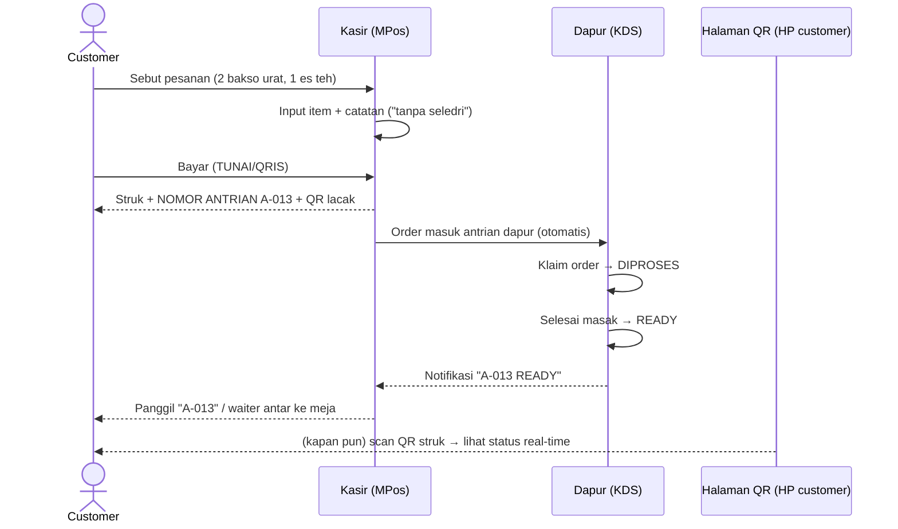
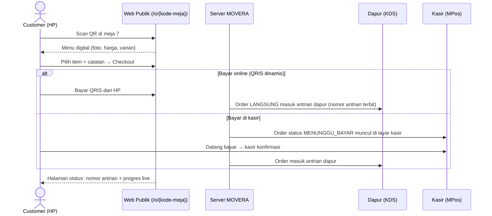
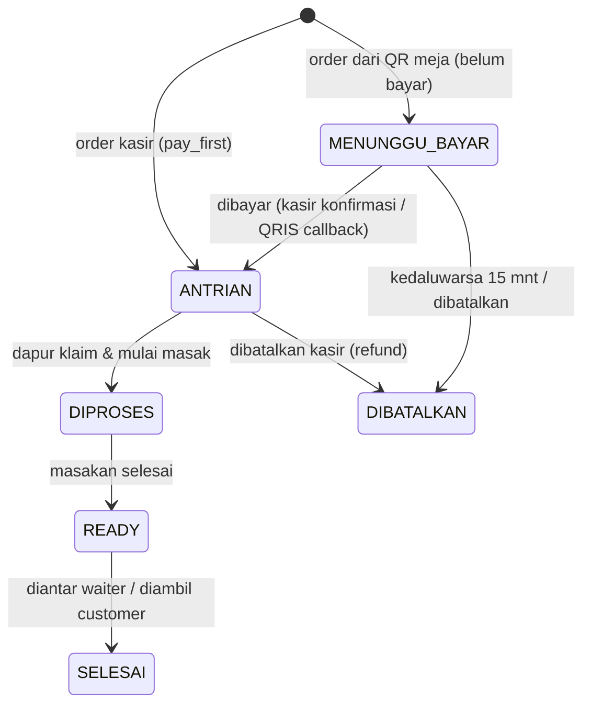
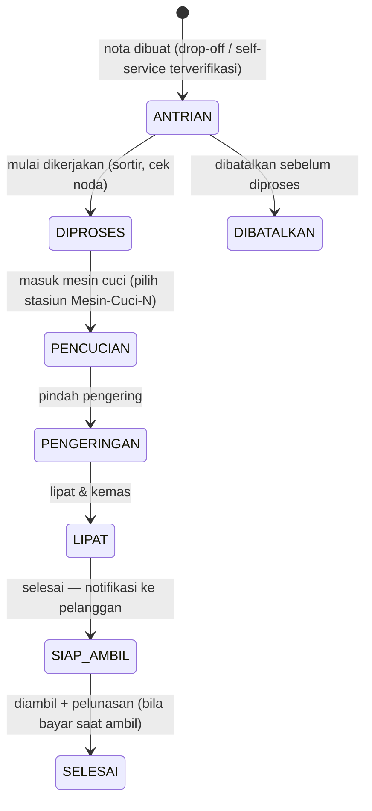

# MPos Universal — Blueprint POS Multi-Bidang-Usaha

> **Visi:** Satu aplikasi MPos untuk semua jenis usaha. Menu, alur kerja, dan
> tampilan menyesuaikan otomatis dengan bidang usaha toko — warung bakso punya
> Dapur dan nomor antrian, laundry punya tahapan cuci–kering–lipat, minimarket
> tetap kasir cepat seperti sekarang. Pelanggan dapat memesan dan memantau
> status pesanannya sendiri lewat QR code.

| Dokumen terkait | Isi |
|---|---|
| [Docs-API.md](Docs-API.md) | Referensi MOVERA POS API (sudah punya `/tokos`, manifest, `/orders`) |
| [README.md](README.md) | Arsitektur aplikasi MPos saat ini |

---

## Daftar Isi

1. [Ringkasan Konsep](#1-ringkasan-konsep)
2. [Prinsip Desain](#2-prinsip-desain)
3. [Istilah & Konsep Inti](#3-istilah--konsep-inti)
4. [Arsitektur Tingkat Tinggi](#4-arsitektur-tingkat-tinggi)
5. [Archetype & Matriks Modul](#5-archetype--matriks-modul)
6. [Manifest Toko — Kontrak + Contoh](#6-manifest-toko--kontrak--contoh)
7. [Stasiun & Peran (Dapur/Kasir/Waiter)](#7-stasiun--peran-dapurkasirwaiter)
8. [Alur Lengkap: Penjualan Bakso (F&B)](#8-alur-lengkap-penjualan-bakso-fb)
9. [Alur Lengkap: Laundry (Jasa Bertahap)](#9-alur-lengkap-laundry-jasa-bertahap)
10. [Pelacakan & Pemesanan Pelanggan via QR](#10-pelacakan--pemesanan-pelanggan-via-qr)
11. [Dampak pada Aplikasi MPos Desktop](#11-dampak-pada-aplikasi-mpos-desktop)
12. [Model Data](#12-model-data)
13. [Pemetaan API](#13-pemetaan-api)
14. [Aturan Transisi Status](#14-aturan-transisi-status)
15. [Roadmap Implementasi](#15-roadmap-implementasi)
16. [Keputusan Terbuka](#16-keputusan-terbuka)

---

## 1. Ringkasan Konsep

Hari ini MPos adalah POS **minimarket** (katalog → keranjang → bayar → struk).
Blueprint ini mengubahnya menjadi **platform POS universal**:

- **Satu aplikasi, banyak wajah.** Saat login, MPos membaca *manifest* toko dari
  server dan membangun menunya secara dinamis. Toko bakso melihat kartu
  **Dapur** dan **Antrian**; laundry melihat **Papan Proses** dengan tahap
  cuci–kering–lipat; minimarket tetap ringkas seperti sekarang. Tidak ada
  build/aplikasi terpisah per bidang usaha.
- **Alur (flow) ikut berubah, bukan cuma menu.** Di minimarket transaksi
  selesai di kasir. Di bakso, pesanan *hidup* setelah dibayar: masuk antrian
  dapur → diproses → siap → diantar. Di laundry, satu nota berjalan berhari-hari
  melewati tahapan produksi.
- **Pelanggan ikut bermain.** Lewat QR code pelanggan bisa: memesan sendiri
  dari meja (bakso), mendaftarkan cucian sendiri (laundry *self-service*), dan
  **memantau status** pesanannya real-time tanpa aplikasi tambahan — cukup
  browser HP.
- **Pemilik toko yang menentukan kapasitas.** Berapa dapur, berapa kasir,
  berapa waiter, mesin cuci mana yang aktif — semuanya pengaturan, bukan
  hard-code.

**Pondasi sudah ada.** MOVERA API telah menyediakan `GET /tokos` (dengan
`bidang_usaha.archetype`), `GET /tokos/{id}/manifest` (berisi `menus`,
`capabilities`, `transaction_flow`, `lifecycle`, `item_config`,
`payment_modes`), `POST /orders` + `/orders/{id}/transition`, dan
`POST /sync/batch`. Blueprint ini adalah desain sisi klien + kebutuhan
tambahan sisi server di atas pondasi tersebut.

---

## 2. Prinsip Desain

1. **Manifest-driven, bukan if-else per bisnis.** Aplikasi TIDAK boleh berisi
   `if (bakso) … else if (laundry) …`. Aplikasi hanya mengerti *konsep umum*
   (modul, stasiun, tahapan, antrian); kombinasinya ditentukan manifest.
2. **Archetype, bukan daftar bisnis tak terbatas.** Ratusan bidang usaha
   dipetakan ke sedikit **archetype** (pola alur). Bakso dan kafe = archetype
   yang sama (`food_order`); laundry dan sablon = `service_job`. Menambah
   bidang usaha baru = menulis manifest, bukan menulis kode.
3. **Satu sumber kebenaran status: server.** Semua transisi status lewat
   `POST /orders/{id}/transition` — layar dapur, kasir, dan halaman QR
   pelanggan hanyalah *view* dari data yang sama.
4. **Pelanggan tanpa akun, tanpa install.** Halaman QR adalah web publik
   ber-token acak. Tidak ada login pelanggan, tidak ada data sensitif.
5. **Offline-tolerant.** Kasir tetap bisa mencatat saat internet putus;
   antrean dikirim lewat `POST /sync/batch` saat tersambung (untuk KDS/QR,
   real-time butuh koneksi — degradasi wajar).
6. **Kompatibel mundur.** Toko `inventory_sale` (minimarket) berjalan persis
   seperti MPos hari ini — blueprint ini murni aditif.

---

## 3. Istilah & Konsep Inti

| Istilah | Arti |
|---|---|
| **Toko** | Unit operasional POS milik company (`GET /tokos`). Satu company bisa punya banyak toko dengan bidang usaha berbeda. |
| **Bidang usaha** | Jenis bisnis toko (mis. `bakso`, `laundry`, `minimarket`) — punya `code`, `nama`, `kategori`, `archetype`. |
| **Archetype** | Pola alur transaksi yang dianut bidang usaha. Menentukan modul & siklus hidup order. |
| **Manifest** | JSON konfigurasi per toko dari server: menu yang tampil, kapabilitas, alur transaksi, tahapan status, konfigurasi item, mode bayar. |
| **Order** | Pesanan yang *hidup* — punya status yang berubah seiring waktu (beda dengan **Transaksi** kasir yang selesai seketika). |
| **Stasiun (station)** | Titik kerja fisik/logis: Kasir-1, Dapur-1, Dapur-2, Waiter-A, Mesin-Cuci-3. Punya jenis, nama, dan status aktif. |
| **Tahap (stage)** | Salah satu langkah dalam lifecycle order: `ANTRIAN`, `DIPROSES`, `READY`, … Ditentukan manifest per archetype. |
| **Nomor antrian** | Nomor urut harian per toko (mis. `A-013`) untuk memanggil pelanggan / menandai pesanan di dapur. |
| **QR meja / QR nota** | QR code yang membuka halaman web publik: QR meja = memesan dari meja; QR nota = melacak status pesanan/cucian. |
| **KDS** | *Kitchen Display System* — layar dapur berisi kartu pesanan per antrian. |

---

## 4. Arsitektur Tingkat Tinggi

```
                          ┌─────────────────────────────┐
   HP Pelanggan (browser) │  Web Publik Pelanggan       │
   scan QR meja / QR nota │  /o/{kode-meja}  → pesan    │
                          │  /t/{token-order} → lacak   │
                          └─────────────┬───────────────┘
                                        │ HTTPS (tanpa login)
                                        ▼
┌──────────────┐  HTTP lokal  ┌──────────────────┐  HTTPS   ┌─────────────────┐
│ MPos Desktop │─────────────▶│ mpos-backend     │─────────▶│ MOVERA API      │
│ (Electron)   │              │ (gateway Go)     │          │ tatreport.com   │
│ Kasir/KDS/   │              │ cache+ratelimit  │          │ /tokos /orders  │
│ Papan Proses │              └──────────────────┘          │ /transition     │
└──────────────┘                                            │ + web publik    │
      ▲  manifest menentukan menu & alur                    └─────────────────┘
      └── GET /tokos/{id}/manifest saat login/ganti toko
```

- **MPos Desktop** dipakai staf (kasir, dapur, waiter, petugas laundry). Satu
  aplikasi; layar yang tampil tergantung manifest + peran perangkat.
- **Web publik pelanggan** dirender oleh server MOVERA (atau layanan web
  terpisah) — bukan bagian dari Electron. Blueprint mendefinisikan kontraknya.
- **Gateway** tetap seperti sekarang (cache, rate limit, allowlist) dan
  meneruskan endpoint orders; event status memakai *polling* interval pendek
  pada fase awal (lihat [§16](#16-keputusan-terbuka) soal push/WebSocket).

---

## 5. Archetype & Matriks Modul

Tiga archetype awal (bisa bertambah, mis. `booking` untuk barbershop/rental):

| Archetype | Contoh bidang usaha | Ciri alur |
|---|---|---|
| `inventory_sale` | Minimarket, toko kelontong, apotek* | Bayar = selesai. Stok FIFO. Tanpa tahapan. |
| `food_order` | Bakso, warung makan, kafe, coffee shop | Pesan (kasir/QR meja) → bayar → **dapur** memproses per antrian → ready → diantar/diambil. |
| `service_job` | Laundry, sablon, servis sepatu | Terima order → **tahapan produksi** berhari-hari → siap diambil → diserahkan. Pelanggan memantau progres. |

Modul yang tampil di Beranda MPos ditentukan archetype + capabilities:

| Modul (kartu Beranda) | `inventory_sale` (minimarket) | `food_order` (bakso) | `service_job` (laundry) |
|---|:---:|:---:|:---:|
| Kasir (katalog + bayar) | ✅ | ✅ | ✅ (terima order + timbang) |
| **Dapur (KDS)** | — | ✅ | — |
| **Antrian / Papan Order** | — | ✅ (nomor antrian) | ✅ (papan tahapan) |
| **Meja & QR** | — | ✅ (opsional dine-in) | — |
| **Stasiun** (atur dapur/kasir/waiter/mesin) | — | ✅ | ✅ |
| Riwayat transaksi | ✅ | ✅ | ✅ |
| Sesi kasir (X/Z) | ✅ | ✅ | ✅ |
| Laporan | ✅ | ✅ | ✅ (+ laporan tahapan) |
| Stok bahan | ✅ (produk = stok) | ✅ (bahan baku, opsional) | ✅ (deterjen dsb., opsional) |
| Pengaturan | ✅ | ✅ | ✅ |

> \* Contoh; penetapan archetype per bidang usaha dikelola katalog
> `GET /bidang-usaha` di server.

**Contoh persis dari visi:** *"jika di laundry tidak ada dapur maka di
penjualan bakso ada dapur"* → kartu **Dapur** hanya muncul bila
`capabilities.kitchen = true` di manifest — laundry tidak memilikinya,
sebagai gantinya laundry punya **Papan Proses** (`capabilities.stages`).

---

## 6. Manifest Toko — Kontrak + Contoh

`GET /tokos/{id}/manifest` — bidang yang dipakai klien:

| Field | Fungsi di MPos |
|---|---|
| `vertical_code` | Kode bidang usaha (`bakso`, `laundry`, `minimarket`) |
| `schema_version` / `min_app_build` | Kompatibilitas — aplikasi menolak manifest yang terlalu baru |
| `menus` | Daftar modul/kartu Beranda yang tampil (+ urutan) |
| `capabilities` | Saklar fitur: `kitchen`, `queue`, `tables_qr`, `stages`, `self_service`, `weighing`, … |
| `transaction_flow` | `pay_first` (bakso: bayar → proses) atau `pay_later` / `pay_on_pickup` (laundry: bisa bayar saat ambil) |
| `lifecycle` | **Daftar tahap status order berurutan** + label + siapa yang boleh transisi |
| `item_config` | Cara item dijual: `unit` (porsi/pcs), `weight` (kiloan), `service` (paket layanan) |
| `payment_modes` | TUNAI / TRANSFER / QRIS (+ `qris_dynamic` untuk bayar dari HP) |

### 6.1 Contoh manifest — Warung Bakso

```json
{
  "vertical_code": "bakso",
  "archetype": "food_order",
  "schema_version": 1,
  "menus": ["kasir", "dapur", "antrian", "meja", "riwayat", "sesi", "laporan", "stasiun", "pengaturan"],
  "capabilities": {
    "kitchen": true,
    "queue": true,
    "tables_qr": true,
    "stages": false,
    "self_service": false,
    "customer_tracking": true
  },
  "transaction_flow": "pay_first",
  "lifecycle": [
    { "stage": "ANTRIAN",  "label": "Menunggu Dapur", "actor": ["kitchen"],          "customer_label": "Pesanan diterima" },
    { "stage": "DIPROSES", "label": "Sedang Dimasak", "actor": ["kitchen"],          "customer_label": "Sedang disiapkan" },
    { "stage": "READY",    "label": "Siap Disajikan", "actor": ["kitchen","waiter"], "customer_label": "Siap! Silakan diambil / menunggu diantar" },
    { "stage": "SELESAI",  "label": "Selesai",        "actor": ["waiter","cashier"], "customer_label": "Selamat menikmati 🍜" }
  ],
  "item_config": { "mode": "unit", "modifiers": true, "notes": true },
  "payment_modes": ["TUNAI", "QRIS", "TRANSFER"],
  "station_types": [
    { "type": "cashier", "label": "Kasir",  "min": 1 },
    { "type": "kitchen", "label": "Dapur",  "min": 1 },
    { "type": "waiter",  "label": "Waiter", "min": 0 }
  ]
}
```

### 6.2 Contoh manifest — Laundry

```json
{
  "vertical_code": "laundry",
  "archetype": "service_job",
  "schema_version": 1,
  "menus": ["kasir", "proses", "riwayat", "sesi", "laporan", "stasiun", "pengaturan"],
  "capabilities": {
    "kitchen": false,
    "queue": true,
    "tables_qr": false,
    "stages": true,
    "self_service": true,
    "customer_tracking": true,
    "weighing": true,
    "labels": true
  },
  "transaction_flow": "pay_first_or_on_pickup",
  "lifecycle": [
    { "stage": "ANTRIAN",     "label": "Antrian",     "actor": ["staff"], "customer_label": "Cucian diterima, menunggu diproses" },
    { "stage": "DIPROSES",    "label": "Diproses",    "actor": ["staff"], "customer_label": "Cucian mulai dikerjakan" },
    { "stage": "PENCUCIAN",   "label": "Pencucian",   "actor": ["staff"], "customer_label": "Sedang dicuci 🫧" },
    { "stage": "PENGERINGAN", "label": "Pengeringan", "actor": ["staff"], "customer_label": "Sedang dikeringkan" },
    { "stage": "LIPAT",       "label": "Lipat & Kemas","actor": ["staff"], "customer_label": "Sedang dilipat & dikemas" },
    { "stage": "SIAP_AMBIL",  "label": "Siap Diambil", "actor": ["staff","cashier"], "customer_label": "Selesai! Silakan diambil ✅" },
    { "stage": "SELESAI",     "label": "Diserahkan",   "actor": ["cashier"], "customer_label": "Sudah diambil. Terima kasih!" }
  ],
  "item_config": { "mode": "weight_or_unit", "services": ["cuci-kering-lipat", "cuci-kering", "setrika", "bed-cover"], "express_multiplier": true },
  "payment_modes": ["TUNAI", "QRIS", "TRANSFER"],
  "station_types": [
    { "type": "cashier", "label": "Kasir / Penerimaan", "min": 1 },
    { "type": "washer",  "label": "Mesin Cuci",  "min": 0 },
    { "type": "dryer",   "label": "Pengering",   "min": 0 },
    { "type": "folder",  "label": "Meja Lipat",  "min": 0 }
  ]
}
```

> Perhatikan: **aplikasi tidak tahu apa itu "bakso" atau "laundry"** — ia hanya
> merender `menus`, mengaktifkan modul sesuai `capabilities`, dan menggambar
> papan status dari `lifecycle`. Tahapan `PENCUCIAN → PENGERINGAN → LIPAT`
> hanyalah entri array; besok bisa ditambah `SETRIKA` tanpa update aplikasi.

---

## 7. Stasiun & Peran (Dapur/Kasir/Waiter)

Sesuai visi: *"pengguna / user bisa setting berapa dapur/kasir/waiter dengan
statusnya apa."*

### 7.1 Model stasiun

| Field | Contoh | Keterangan |
|---|---|---|
| `id` | `STN-003` | Terenkripsi (pola MOVERA) |
| `type` | `kitchen` \| `cashier` \| `waiter` \| `washer` \| `dryer` \| `folder` | Jenis dari `station_types` manifest |
| `nama` | "Dapur 2", "Mesin Cuci Besar" | Bebas |
| `status` | `AKTIF` \| `ISTIRAHAT` \| `NONAKTIF` | Diatur pemilik/kepala toko |
| `kapasitas` | 5 | Maks order yang bisa dipegang bersamaan (opsional) |
| `assigned_user` | "Budi" | Opsional — staf yang bertugas |

### 7.2 Perilaku

- **Pengaturan → Stasiun**: CRUD stasiun per toko; jumlah bebas (2 dapur,
  3 kasir, 4 mesin cuci — terserah pemilik).
- **Routing order**: order baru masuk ke antrian jenis stasiun terkait
  (bakso → `kitchen`). Mode routing: *ambil-sendiri* (stasiun mengklaim order
  dari antrian bersama — default, sederhana) atau *round-robin* (server
  membagi rata). Stasiun `NONAKTIF`/`ISTIRAHAT` tidak menerima order baru.
- **Perangkat = stasiun**: di Pengaturan, sebuah perangkat MPos dapat
  ditetapkan berperan sebagai stasiun tertentu → aplikasi langsung membuka
  layar kerja stasiun itu (mis. tablet di dapur langsung tampil KDS Dapur-1).
- **Sesi kasir tetap per-kasir** seperti sekarang (X/Z report per stasiun
  kasir).

---

## 8. Alur Lengkap: Penjualan Bakso (F&B)

### 8.1 Dua pintu masuk pesanan

**Jalur A — langsung ke kasir** (seperti warung pada umumnya):



**Jalur B — pesan dari meja via QR** (*"customer bisa pesan dari meja dengan
scan QR codenya, nanti tampil menunya"*):



### 8.2 Siklus hidup order bakso



### 8.3 Layar Dapur (KDS)

- Grid kartu order: **nomor antrian besar**, meja (bila ada), daftar item +
  catatan, umur order (menit berjalan — menguning >10 mnt, memerah >15 mnt).
- Tombol besar ramah layar sentuh: **Mulai Masak** (→ DIPROSES) dan **Siap**
  (→ READY). Multi-dapur: kartu yang diklaim Dapur-1 terkunci dari Dapur-2.
- Suara "ting" saat order baru masuk. Kolom: Antrian │ Sedang Dimasak │ Siap.

### 8.4 Nomor antrian

- Format `{prefix}-{urut}` per toko per hari (reset tiap buka sesi): `A-001`…
- Tercetak di struk + tampil di halaman QR + dipanggil dari layar READY.
- Opsional: **layar antrian publik** (TV) menampilkan nomor SEDANG DIMASAK
  vs SIAP — modul tampilan dari data yang sama.

### 8.5 Bon Meja / Open Bill — bayar di akhir (masukan Taufiq, Jul 2026)

Selain "pesan → bayar → masak" (jalur A/B di atas), warung sungguhan umumnya
**open bill**: pelanggan duduk, pesan, makan, lalu **bayar saat pulang**. MPos
mendukung ini penuh lewat **Peta Meja** — dipilih manifest via
`transaction_flow: ["OPEN_BILL", …]` (bakso). Rangkuman alur persis dari Pak
Taufiq:

```
Peta Meja (grid kosong/terisi)
   │  ketuk MEJA KOSONG → tanya jumlah orang (pax) → BON DIBUKA
   ▼
Input pesanan (katalog) → "Simpan Pesanan ke Dapur"
   │  → tiket dapur ber-LABEL MEJA (bukan nomor antrian) masuk KDS
   │  pesanan susulan? buka lagi meja → tambah ronde → simpan  (bisa berkali-kali)
   ▼
"Cetak Bill"  → pra-bon (hitungan, ditandai BELUM DIBAYAR)
   ▼
"Bayar" (F4) → pilih metode → STRUK LUNAS terbit → bon di-CLOSE
   ▼
Meja otomatis KOSONG lagi, siap dibuka pelanggan berikutnya
```

**Peta Meja** (mengikuti referensi aplikasi kelas atas): kartu per meja dengan
**status berwarna** (Kosong / Belum order / Sudah order / Minta bayar),
**timer berjalan** sejak bon dibuka, **jumlah orang (pax)**, dan **total bon
berjalan**. Ada pencarian meja dan **Gabung Meja** (rombongan lintas-meja →
satu tagihan).

Aturan penting:

- **Uang tercatat hanya saat pelunasan** (bukan saat bon dibuka) — bon berjalan
  bukan transaksi kas; sesi kasir bertambah hanya di `bill:bayar`.
- **Nomor MEJA menonjol** di kartu KDS (font besar) — pengantar langsung tahu
  tujuan tanpa bertanya (permintaan eksplisit Taufiq).
- **Satu meja = satu bon**; tiap "Simpan" = satu tiket dapur (ronde) baru yang
  bergabung ke bon. Item sama antar-ronde diagregasi di pra-bon & struk.
- **QR meja menyatu dengan bon**: bila pelanggan memesan sendiri via QR meja di
  toko `OPEN_BILL`, pesanannya **masuk ke bon meja yang sama** dan langsung ke
  dapur (bukan `MENUNGGU_BAYAR`). Toko tanpa `OPEN_BILL` tetap memakai jalur
  konfirmasi-bayar lama.
- **Cetak Bill** tidak menyentuh kas; mencetak ulang setelah ada pesanan susulan
  otomatis membatalkan pra-bon lama.
- **Kosongkan Meja** (batal) tersedia untuk koreksi — membebaskan meja tanpa
  pembayaran dan menyelesaikan tiket dapur yang tersisa.

**Tiga pola pembayaran kini hidup semua** (dipilih per toko dari manifest):

| Pola | `transaction_flow` | Contoh | Kas tercatat |
|---|---|---|---|
| Bayar dulu | `PAYMENT` (default) | Minimarket, takeaway bakso | Saat checkout |
| Bayar saat ambil | `PAYMENT_OR_LATER` | Laundry | Saat pelunasan (§9.1) |
| **Bon meja (bayar di akhir)** | **`OPEN_BILL`** | **Warung bakso dine-in** | **Saat tutup bon** |

---

## 9. Alur Lengkap: Laundry (Jasa Bertahap)

### 9.1 Dua pintu masuk

**Jalur A — drop-off ke kasir:** petugas menimbang (`weighing`), memilih
layanan (kiloan cuci-kering-lipat / satuan bed cover / express ×1.5),
mencetak **nota + label QR** per bundel cucian. Pembayaran: di muka atau saat
ambil (`pay_first_or_on_pickup` — kebijakan per toko).

**Jalur B — self-service** (*"laundry bisa self service"*): pelanggan scan QR
di gerai → isi form (nama, HP, jenis layanan, estimasi berat) → dapat **kode
setor**. Petugas memverifikasi & menimbang ulang saat serah terima → order
resmi masuk `ANTRIAN`. (Untuk gerai self-service bermesin koin/kiosk, tahap
verifikasi bisa dilewati — capability `self_service_kiosk`.)

### 9.2 Siklus hidup order laundry

Persis dari visi Anda — *antrian / diproses / pencucian / pengeringan / lipat*:



Setiap transisi mencatat **stempel waktu + stasiun + petugas** → timeline yang
dilihat pelanggan dan bahan laporan produktivitas (rerata durasi per tahap,
beban per mesin).

### 9.3 Papan Proses (pengganti "Dapur" untuk laundry)

Layar kanban dengan kolom = tahap lifecycle. Kartu nota digeser antar kolom
(atau via tombol) = memanggil `transition`. Kartu menampilkan: kode nota,
nama pelanggan, kg/itemisasi, layanan, tenggat (express!), stasiun terpasang.

### 9.4 Halaman status pelanggan

Scan QR pada nota → timeline visual:

```
  ● Antrian          Sab 14:05   ✓
  ● Diproses         Sab 14:32   ✓
  ● Pencucian        Sab 14:40   ✓
  ◐ Pengeringan      — sedang berlangsung
  ○ Lipat & Kemas
  ○ Siap Diambil     (estimasi: Minggu 12:00)
```

Plus: rincian nota, total & status bayar, tombol "Hubungi toko" (WA/telepon).
Opsional per toko: notifikasi WhatsApp saat `SIAP_AMBIL`.

---

## 10. Pelacakan & Pemesanan Pelanggan via QR

Dua jenis QR, satu prinsip: **web publik, tanpa login, token acak**.

| | QR Meja / Gerai (`/o/{kode}`) | QR Nota / Struk (`/t/{token}`) |
|---|---|---|
| Dicetak di | Stiker meja (bakso), poster gerai (laundry) | Struk kasir / label nota |
| Isi halaman | Menu digital + keranjang + checkout | Status order + timeline + rincian |
| Masa berlaku | Permanen (per meja/gerai) | Selama order hidup + N hari |
| Keamanan | Kode meja publik — order yang dibuat berstatus `MENUNGGU_BAYAR` sampai dibayar/dikonfirmasi (mencegah order sampah) | Token acak ≥128-bit, tidak bisa ditebak; hanya menampilkan data order itu; tanpa PII selain nama panggilan |

Ketentuan teknis:

- Halaman publik dilayani **server MOVERA** (bukan Electron) — ringan,
  mobile-first, tanpa framework berat; membaca data dari endpoint publik
  `GET /public/track/{token}` dan `GET /public/menu/{kode-meja}` +
  `POST /public/order`.
- Rate limit ketat + CAPTCHA ringan/honeypot pada `POST /public/order`.
- Status di halaman lacak memakai `customer_label` dari manifest (bahasa
  pelanggan, bukan istilah internal).
- Pembayaran online: QRIS dinamis per order (callback pembayaran mengubah
  `MENUNGGU_BAYAR → ANTRIAN` otomatis).

---

## 11. Dampak pada Aplikasi MPos Desktop

Perubahan pada aplikasi Electron yang sudah ada (semuanya aditif):

1. **Pemilihan toko saat login.** Bila company punya >1 toko: pilih toko →
   `GET /tokos/{id}/manifest` → simpan di state. Toko tunggal: otomatis.
2. **Beranda dinamis.** Kartu menu dirender dari `manifest.menus` (hari ini
   daftar layar statis). Registry layar tetap di kode; manifest memilih mana
   yang tampil. Kartu baru: **Dapur/KDS**, **Papan Proses**, **Antrian**,
   **Meja & QR**, **Stasiun**.
3. **Layar Kasir menyesuaikan `item_config`**: mode `weight` menampilkan input
   berat + kalkulasi harga/kg; `modifiers/notes` menampilkan catatan per item;
   `transaction_flow` menentukan tombol ("Bayar" vs "Simpan Order — bayar
   nanti").
4. **Layar baru (generik, digerakkan manifest):**
   - `orders.js` — daftar order hidup + filter tahap (dipakai semua archetype
     ber-`queue`).
   - `kds.js` — kanban kartu besar layar-sentuh; kolomnya dari `lifecycle`
     (dapur bakso = 3 kolom; laundry = 6 kolom — komponen yang sama).
   - `stations.js` — CRUD stasiun + status + penetapan perangkat.
   - `tables.js` — kelola meja + cetak PDF stiker QR (hanya bila `tables_qr`).
5. **Demo mode diperluas**: tiga toko contoh (Minimarket TES, Bakso Demo,
   Laundry Demo) agar seluruh alur bisa dijajal tanpa server — sekaligus jadi
   alat pengembangan UI.
6. **Polling order**: layar KDS/Papan/Antrian menyegarkan tiap 3–5 dtk via
   gateway (cache dimatikan untuk `/orders`) sampai kanal push tersedia.

---

## 12. Model Data

Entitas baru/diperluas (sisi server; nama mengikuti konvensi MOVERA):

```
toko            (sudah ada) + relasi: stations, tables
station         id, toko_id, type, nama, status, kapasitas, user_id?
table           id, toko_id, nomor, kode_qr (unik), aktif          [food_order]
order           id, toko_id, nomor, no_antrian, tipe_sumber(KASIR|QR_MEJA|SELF_SERVICE),
                table_id?, pelanggan?, status_tahap, status_bayar(BELUM|LUNAS|DP),
                total..., token_lacak, tenggat?, express?
order_item      order_id, produk/layanan_id, qty|berat, harga, catatan, modifiers
order_event     order_id, dari_tahap, ke_tahap, station_id?, user_id, waktu   ← timeline
queue_counter   toko_id, tanggal, prefix, nilai_terakhir                      ← nomor antrian
```

Relasi ke yang sudah ada: saat order **dibayar**, terbit transaksi POS standar
(jurnal + stok seperti checkout sekarang) — order adalah lapisan alur di atas
transaksi, bukan penggantinya.

---

## 13. Pemetaan API

### Sudah tersedia di MOVERA (Docs-API.md)

| Endpoint | Peran dalam blueprint |
|---|---|
| `GET /tokos`, `GET /tokos/{id}` | Daftar & pemilihan toko |
| `GET /tokos/{id}/manifest` | **Jantung sistem** — menu/capabilities/lifecycle |
| `GET /bidang-usaha` | Katalog vertical saat membuat toko |
| `GET/POST /orders`, `GET /orders/{id}` | CRUD order hidup |
| `POST /orders/{id}/transition` | Transisi tahap (ANTRIAN→DIPROSES→…) |
| `POST /sync/batch` | Antrean offline |
| `POST /transaksi/checkout` | Pembayaran → jurnal + stok (dipanggil saat order dibayar) |

### Perlu ditambahkan di server (proposal)

| Endpoint | Fungsi |
|---|---|
| `GET/POST/PATCH /stations` | CRUD stasiun + status |
| `GET/POST /tables`, `GET /tables/{id}/qr.png` | Meja + QR meja |
| `GET/POST /bills`, `GET/PATCH /bills/{id}` | Bon meja (open bill): buka/ubah pax |
| `POST /bills/{id}/rounds` | Tambah ronde pesanan → tiket dapur |
| `GET /bills/{id}/prebill` | Pra-bon (hitungan belum bayar) |
| `POST /bills/{id}/settle` \| `/merge` \| `/void` | Lunasi & tutup \| gabung meja \| batal |
| `GET /orders?stage=&station=&sumber=` | Filter untuk KDS/Papan |
| `GET /public/menu/{kode-meja}` | Menu digital publik |
| `POST /public/order` | Order dari HP pelanggan |
| `GET /public/track/{token}` | Status + timeline untuk pelanggan |
| `POST /payments/qris` + callback | QRIS dinamis order online |
| `GET /laporan/tahapan` | Durasi per tahap / beban stasiun |

Gateway MPos: tambahkan rute-rute baru ke allowlist (pola sama seperti
sekarang; `/orders` tanpa cache, `/tables` & `/stations` cache pendek).

---

## 14. Aturan Transisi Status

1. **Hanya maju sesuai urutan lifecycle** (kecuali `DIBATALKAN`). Mundur satu
   tahap diizinkan untuk koreksi oleh peran `owner/kepala toko` dan tercatat
   di `order_event` sebagai koreksi.
2. **Otorisasi per tahap** dari `lifecycle[].actor` — mis. hanya stasiun
   `kitchen` yang boleh `ANTRIAN→DIPROSES` di bakso.
3. **Transisi idempoten** — dua klik "Siap" beruntun tidak menghasilkan dua
   event (server menolak transisi dari tahap yang sudah lewat → 409).
4. **Pembatalan**: sebelum `DIPROSES` bebas; sesudahnya butuh peran
   owner + alasan; bila sudah dibayar → jalur refund/void transaksi standar.
5. **Kedaluwarsa**: `MENUNGGU_BAYAR` auto-batal setelah N menit (default 15,
   per manifest).
6. Setiap transisi menyiarkan perubahan ke: KDS, layar kasir, papan antrian,
   dan halaman QR pelanggan (fase awal: polling; nanti: push).

---

## 15. Roadmap Implementasi

| Fase | Lingkup | Hasil yang bisa dipakai | Status |
|---|---|---|---|
| **1. Fondasi manifest** | Pemilihan toko + fetch manifest; Beranda dinamis dari `menus`; demo mode 3 toko | MPos "berubah wajah" per toko | ✅ Selesai (Jul 2026) |
| **2. Order + KDS (bakso, jalur kasir)** | Layar `orders` + KDS generik; nomor antrian; stasiun; + bonus layar Produk & Pelanggan | Warung bakso beroperasi penuh via kasir | ✅ Selesai (Jul 2026) |
| **3. Lacak status QR (read-only)** | `token_lacak` di struk; halaman lacak; QR tercetak di struk | Pelanggan pantau status dari HP | ✅ **Mode LAN lokal** selesai (server internet publik: menunggu MOVERA) |
| **4. Laundry lengkap** | Lifecycle multi-tahap di Papan Proses; lacak QR nota | Laundry beroperasi (timbang/label lanjutan menyusul) | ✅ Inti selesai (weighing UI & label: berikutnya) |
| **5. QR meja + order online** | Meja + QR + menu digital + `MENUNGGU_BAYAR` + konfirmasi kasir | Pelanggan bakso pesan sendiri dari meja | ✅ **Mode LAN** selesai (QRIS online: menunggu server) |
| **6. Penyempurnaan** | Push/real-time, notifikasi WA, ~~layar antrian TV~~ ✅, ~~suara KDS~~ ✅, laporan tahapan, routing round-robin, kiosk | Skala & kenyamanan | ⏳ Sebagian |
| **7. Bon Meja (open bill)** | Peta Meja (status/timer/pax/total), buka meja, ronde pesanan, cetak pra-bon, bayar-di-akhir, gabung meja, label MEJA besar di KDS, QR meja menyatu ke bon (§8.5) | Warung bakso dine-in bayar saat pulang | ✅ **Mode LAN/Demo** selesai (kontrak server `/bills`: menunggu MOVERA) |

Prinsip urutan: tiap fase berdiri sendiri dan langsung berguna; fitur pelanggan
(QR) menyusul setelah alur staf stabil.

---

## 16. Keputusan Terbuka

Perlu keputusan Anda / tim server sebelum implementasi:

1. **Siapa membangun halaman web publik?** Modul baru di MOVERA (Laravel,
   disarankan — satu domain per tenant sudah ada) atau layanan kecil terpisah?
2. **Real-time**: mulai dengan polling 3–5 dtk (sederhana, jalan di semua
   infra) — kapan investasi WebSocket/SSE?
3. **QRIS dinamis**: payment gateway mana (Midtrans/Xendit/…)? Menentukan
   desain callback `MENUNGGU_BAYAR → ANTRIAN`.
4. **Notifikasi WhatsApp** (laundry `SIAP_AMBIL`): pakai WA Business API
   (berbayar) atau cukup halaman QR + SMS-less?
5. **Manifest editor**: pengaturan capabilities per toko dari web admin MOVERA
   — di luar cakupan MPos, perlu ada di server.
6. Bidang usaha ke-3 untuk memvalidasi generalisasi archetype (barbershop =
   `booking`?) — disarankan dirancang di atas kertas sebelum fase 2 selesai
   agar `lifecycle` tidak bias ke dua kasus pertama.

---

*Dokumen ini adalah cetak biru produk — implementasi mengikuti roadmap §15.
Diskusikan §16 lebih dulu; perubahan keputusan akan menggeser detail §10–§13.*
